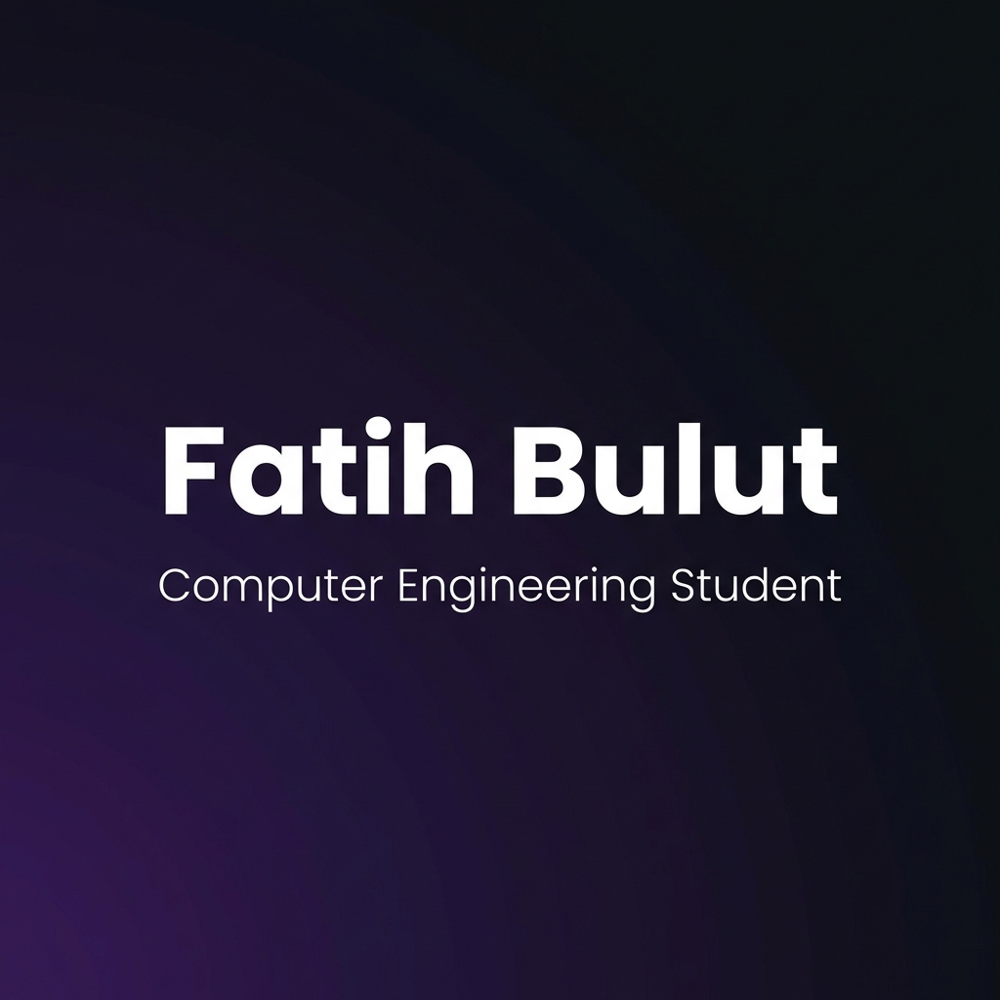

  

   
  
  

---

### 👨‍💻 About Me

Hello! I'm **Fatih Bulut**, a **Computer Engineering Student (3rd Year)**.

I am passionately self-improving in the fields of **Artificial Intelligence**, **Machine Learning**, and **Image Processing (Computer Vision)**. My goal is to bridge the gap between theoretical models and real-world applications.

*   🔭 **Current Focus:** Developing advanced algorithms in **Computer Vision** and **Deep Learning**.
*   🌱 **Learning:** Neural Networks architecture and Big Data analysis.
*   🚀 **Goal:** Mastering the art of intelligent systems.
*   ⚡ **Tech Stack:** From low-level C++ efficiency to high-level Python AI libraries.

---

### 🛠️ Tech Stack & Tools

  <!-- Core & AI -->
  
  
  
  
  
  
  
  

   

  <!-- Web, Mobile & Data -->
  
  
  
  
  

   

  <!-- Tools -->
  
  

---

### 📈 GitHub Stats

<!-- Basit ve Çalışan İstatistik Kartları -->

 
 

---

  

